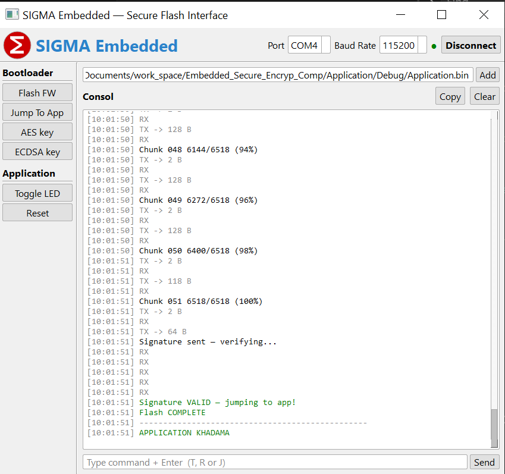

# SIGMA Embedded — Secure Bootloader Interface

**Author:** SAID ARNOUZ  
**Target:** STM32F411  
**Host:** Python 3 + PyQt5  

---

## Overview

SIGMA is a secure firmware update system for the STM32F411 microcontroller.  
It combines **LZSS compression**, **AES-256-GCM encryption**, and **ECDSA P-256 signature verification** to ensure that only authenticated firmware can be flashed onto the device.

The host-side GUI (`sigma_gui.py`) handles all cryptographic operations and communicates with the bootloader over UART.

---

## Features

- AES-256-GCM encryption of compressed firmware
- ECDSA P-256 digital signature — bootloader verifies before jumping to app
- LZSS compression to reduce firmware size before transmission
- PyQt5 desktop GUI with real-time console output
- Automatic port detection and reconnection
- Application mode — Toggle LED, Reset, live serial monitor

---

## Hardware Requirements

| Component | Details |
|-----------|---------|
| MCU | STM32F411CE / STM32F411RE |
| Interface | UART (default: 115200 baud) |
| Flash | Internal flash — application starts at `0x08008000` |
| Crypto lib | STM32 Cryptographic Library (CMOX) |
---

## Installation

```bash
pip install pyserial pyqt5 cryptography
```

---

## Usage

### 1. Generate Keys (first time only)

Click **ECDSA key** → **Gen Keys** in the GUI, or run:

```python
from cryptography.hazmat.primitives.asymmetric import ec
from cryptography.hazmat.primitives import serialization

priv = ec.generate_private_key(ec.SECP256R1())
# save private_key.pem + public_key.pem
```

Then copy the public key C array (shown in console) into `uECC.h`:

```c
static const uint8_t PUBLIC_KEY[64] = {
    0x38, 0x1F, ...
};
```

Reflash the **bootloader** with the new public key before flashing the application.

### 2. Run the GUI

```bash
cd C:\Users\HP\Documents\work_space\Embedded_Secure_Encryp_Comp
python sigma_gui.py
```

### 3. Flash Firmware

1. Click **Add** → select `Application.bin`
2. Select **COM port** and **baud rate**
3. Click **Connect**
4. Press **RESET** on the board
5. Click **Flash FW**

---

## UART Protocol

```
Host → STM32:

  [ IV  12B ]
  [ Tag 16B ]
  [ original_size 4B ]
  [ chunk_size 2B ] [ chunk data N×B ]  ← repeated
  [ END marker 0xFFFF ]
  [ ECDSA signature 64B  R‖S ]

STM32 → Host:

  ACK (0x79) after each step
  ERR (0x1F) on failure
  ACK after signature verified → jumps to app
```

---

## Cryptographic Details

| Algorithm | Details |
|-----------|---------|
| Compression | LZSS — window 256B, min match 3B |
| Encryption | AES-256-GCM — 12B IV, 16B tag |
| Signature | ECDSA P-256 — SHA-256 over raw firmware |
| Key size | 32B private, 64B public (X‖Y uncompressed) |

The STM32 bootloader:
1. Receives IV + Tag + original size
2. Decrypts + decompresses each chunk directly to flash
3. Verifies ECDSA signature over the full decompressed firmware
4. Jumps to application only if signature is valid — otherwise erases flash

---

## Security Notes

- `private_key.pem` must never be shared or committed to version control
- A new keypair requires reflashing the bootloader with the updated public key
- Corrupted signature → STM32 erases the application flash automatically